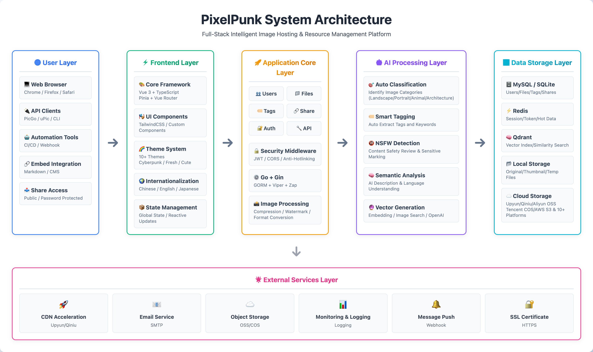
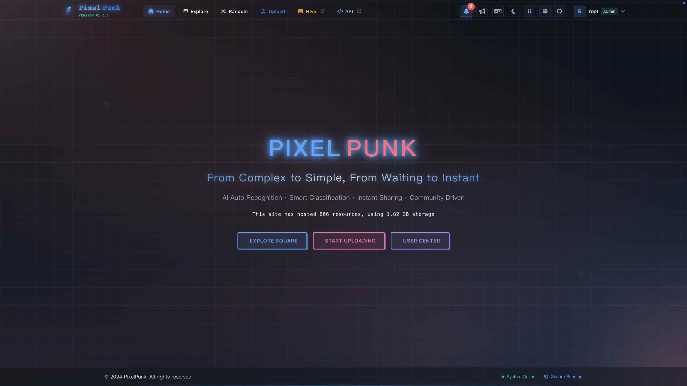

<div align="center">
  

# PixelPunk

**Full-Stack Intelligent Image Hosting & Resource Management Platform**

> Simplify image management from complex to easy, accelerate file sharing from slow to instant

[](https://go.dev/)
[](https://vuejs.org/)
[](https://www.docker.com/)
[](https://openai.com/)
[](https://qdrant.tech/)
[](https://redis.io/)

[English](./README.md) | [简体中文](./README_CN.md) | [Official Website](https://pixelpunk.cc/) | [Live Demo](https://v1.pixelpunk.cc/)

</div>

<div align="center">
  
</div>

---

### Homepage

<div align="center">
  
</div>

### Admin Dashboard

<div align="center">
  
</div>

---

## ✨ Comprehensive Features

<table>
<tr>
<td width="33%" valign="top">

### 📸 Multi-Format Upload

- ✅ Support 10+ format uploads
- ✅ Custom watermarks
- ✅ Expiration time setting
- ✅ Custom upload folders
- ✅ Custom file permissions

</td>
<td width="33%" valign="top">

### 📁 File Management

- ✅ Unlimited nested folders
- ✅ Tag & category system
- ✅ Batch operations
- ✅ Drag & drop
- ✅ Custom context menu
- ✅ Quick favorites access

</td>
<td width="33%" valign="top">

### 🔍 Powerful Search

- ✅ Natural language search
- ✅ Tag search
- ✅ Category search
- ✅ Hybrid search
- ✅ Admin channel search

</td>
</tr>

<tr>
<td width="33%" valign="top">

### 🤖 AI Automation

- ✅ Auto image classification
- ✅ Auto image tagging
- ✅ Auto semantic parsing
- ✅ Auto NSFW detection

</td>
<td width="33%" valign="top">

### 🧠 Vector Search

- ✅ Image-to-image search
- ✅ Semantic similarity search
- ✅ Smart recommendations
- ✅ Powered by Qdrant

</td>
<td width="33%" valign="top">

### 🔗 Flexible Sharing

- ✅ Folder/image/mixed sharing
- ✅ Password & expiration
- ✅ Album & batch download
- ✅ Access email notifications

</td>
</tr>

<tr>
<td width="33%" valign="top">

### 🔐 Access Control

- ✅ Hotlink protection
- ✅ IP whitelist/blacklist
- ✅ Domain whitelist/blacklist
- ✅ Traffic control
- ✅ Bandwidth control
- ✅ Access statistics

</td>
<td width="33%" valign="top">

### 🎨 Multiple Themes

- ✅ 12+ curated themes
- ✅ Cyberpunk, Fresh, Cute styles
- ✅ Light/dark mode
- ✅ Dynamic theme switching

</td>
<td width="33%" valign="top">

### 🌍 Internationalization

- ✅ 🇨🇳 Simplified Chinese
- ✅ 🇺🇸 English
- ✅ 🇯🇵 Japanese
- ✅ Dual-style themes
- ✅ More languages coming

</td>
</tr>

<tr>
<td width="33%" valign="top">

### 👥 User Management

- ✅ Admin/user roles
- ✅ Fine-grained permissions
- ✅ User group management
- ✅ Operation log audit

</td>
<td width="33%" valign="top">

### 💾 Quota Management

- ✅ Traffic control
- ✅ Bandwidth control
- ✅ Request limit
- ✅ Dynamic adjustment

</td>
<td width="33%" valign="top">

### 🔧 Open API

- ✅ Upload & random image API
- ✅ Folder binding & asset pinning
- ✅ Permission & statistics
- ✅ Request/type/size limits

</td>
</tr>

<tr>
<td width="33%" valign="top">

### 🚀 Easy Deployment

- ✅ Single binary file
- ✅ Docker containerization
- ✅ Cross-platform support
- ✅ One-click installer

</td>
<td width="33%" valign="top">

### 📊 Data Statistics

- ✅ Upload statistics charts
- ✅ Storage space analysis
- ✅ Access statistics
- ✅ User behavior analysis

</td>
<td width="33%" valign="top">

### 🎛️ Management System

- ✅ Visual admin interface
- ✅ Real-time monitoring
- ✅ One-click configuration
- ✅ Intuitive operations

</td>
</tr>
</table>

## 💻 System Requirements

### Minimum Configuration

- **OS**: Linux (x86_64/ARM64) / macOS (Intel/Apple Silicon) / Windows (WSL2)
- **CPU**: 2 cores
- **RAM**: 2GB
- **Disk**: 10GB available space
- **Network**: Internet connection (required for AI features)

### Recommended Configuration (Production)

- **CPU**: 4+ cores
- **RAM**: 4GB+
- **Disk**: 50GB+ SSD
- **Network**: Stable internet, 100Mbps+ bandwidth

### Dependencies (Auto-installed in Docker mode)

- **Database**: MySQL 5.7+ / SQLite 3.x
- **Cache**: Redis 6.0+
- **Vector Database**: Qdrant 1.11+ (optional, for AI search)
- **AI Service**: OpenAI API or compatible (optional, for AI features)

---

## 🚀 Quick Start

### Method 1: One-Click Installation

```bash
curl -fsSL http://download.pixelpunk.cc/shell/setup.sh | bash
```

**Supported Platforms**: Linux (x86_64/ARM64), macOS (Intel/Apple Silicon)

The installation script will automatically:

- ✅ Detect system platform
- ✅ Download appropriate package
- ✅ Extract and configure
- ✅ Start PixelPunk service

After installation, visit `http://localhost:9520` to get started.

### Method 2: Docker Deployment

```bash
# Pull image
docker pull snine98/pixelpunk:latest

# Download docker-compose.yml
curl -O https://download.pixelpunk.cc/docker/docker-compose.yml

# Start all services (includes MySQL + Qdrant + Redis)
docker-compose up -d
```

Visit `http://localhost:9520` to get started.

---

## 🎯 First-Time Setup Guide

### 1. Access System

After deployment, open your browser and visit:

- **One-Click Install**: http://localhost:9520
- **Docker Deployment**: http://localhost:9520
- **Custom Port**: Check your configuration file

### 2. Initial Setup

On first visit, you'll be redirected to the setup page. Complete the following:

#### Database Configuration

- **SQLite Mode** (recommended for personal use): Auto-creates local database, no extra setup
- **MySQL Mode** (recommended for production): Fill in database connection details
  - Host: localhost:3306 (auto-configured in Docker mode)
  - Database: pixelpunk
  - Username: root
  - Password: Your set password

#### Administrator Account

Set initial administrator information:

- Username: Recommend using admin or your preferred username
- Password: At least 8 characters, recommend letters and numbers
- Email: For receiving notifications (optional)

### 3. Login

After initialization, login with your administrator account:

1. Click "Login/Register" in the top right
2. Enter username and password
3. Automatically redirected to control panel after successful login

### 4. Start Using

After login, you can:

- 📤 **Upload Images**: Click "Start Upload" or drag & drop files
- 📁 **Manage Files**: View, edit, delete files in "File Management"
- 🔗 **Create Shares**: Right-click files or folders, select "Create Share"
- 🎨 **Switch Themes**: Click theme icon in top right, choose your favorite style
- 🌍 **Switch Language**: Click language switcher (Chinese/English/日本語)

---

### More Resources

- [📥 Download Releases](https://github.com/CooperJiang/PixelPunk-v1/releases) - Download pre-built packages for manual installation
- [🏗️ Architecture Design](docs/ARCHITECTURE.md) - System architecture, workflow, tech stack
- [🚀 Deployment Guide](docs/DEPLOYMENT.md) - Complete deployment guide (one-click, Docker, manual)
- [🐳 Docker Guide](docs/DOCKER-GUIDE.md) - Docker containerization deployment details
- [📘 Development Guide](docs/DEVELOPMENT.md) - Setup development environment, build from source
- [🎨 Theme Development](web/docs/THEME-DEVELOPMENT-GUIDE.md) - Create custom themes
- [🌍 Internationalization](web/docs/I18N-GUIDE.md) - Add language support
- [🤝 Contributing Guide](docs/CONTRIBUTING.md) - How to contribute to the project

---

## 🛠️ Tech Stack

- **Frontend**: Vue 3 + TypeScript + Vite + Pinia + Vue Router + Tailwind CSS + CSS Variables + FontAwesome + Axios + VueUse
- **Backend**: Go 1.24 + Gin + GORM + JWT + Viper + Zap
- **Database**: SQLite / MySQL + Redis + Qdrant (vector database)
- **AI**: OpenAI API compatible + Embedding models + Semantic search
- **DevOps**: Docker + Docker Compose + Nginx/Caddy + Systemd + Make

---

## 📊 Star History

If you like this project, please give it a Star ⭐!

[](https://star-history.com/#CooperJiang/PixelPunk&Date)

---

## 🤝 Contributing

All forms of contribution are welcome!

### How to Contribute

- 🐛 [Report Bugs](https://github.com/CooperJiang/PixelPunk-v1/issues/new?labels=bug)
- 💡 [Suggest Features](https://github.com/CooperJiang/PixelPunk-v1/issues/new?labels=enhancement)
- 📖 [Improve Documentation](https://github.com/CooperJiang/PixelPunk-v1/issues/new?labels=documentation)
- 💻 [Submit Code](docs/CONTRIBUTING.md)

See the [Contributing Guide](docs/CONTRIBUTING.md) for the complete contribution process.

---

## 📝 License

This project is licensed under **PolyForm Noncommercial License 1.0.0**.

- ✅ Personal use
- ✅ Learning & research
- ✅ Non-commercial purposes
- ❌ Commercial use requires authorization

See [LICENSE](./LICENSE) for details.

## 🚧 Upcoming Features

- [ ] Backend multilingual support
- [ ] UI improvements
- [ ] Desktop client development
- [ ] More format support
- [ ] Interaction optimization
- [ ] More storage channels
- [ ] More AI integrations

---

<div align="center">
  <sub>Built with ❤️ by <a href="https://github.com/CooperJiang">CooperJiang</a></sub>
</div>
