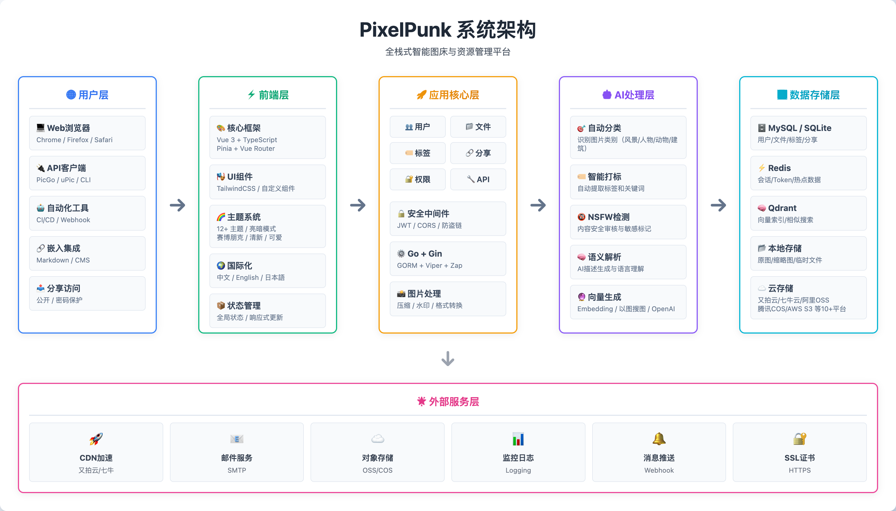
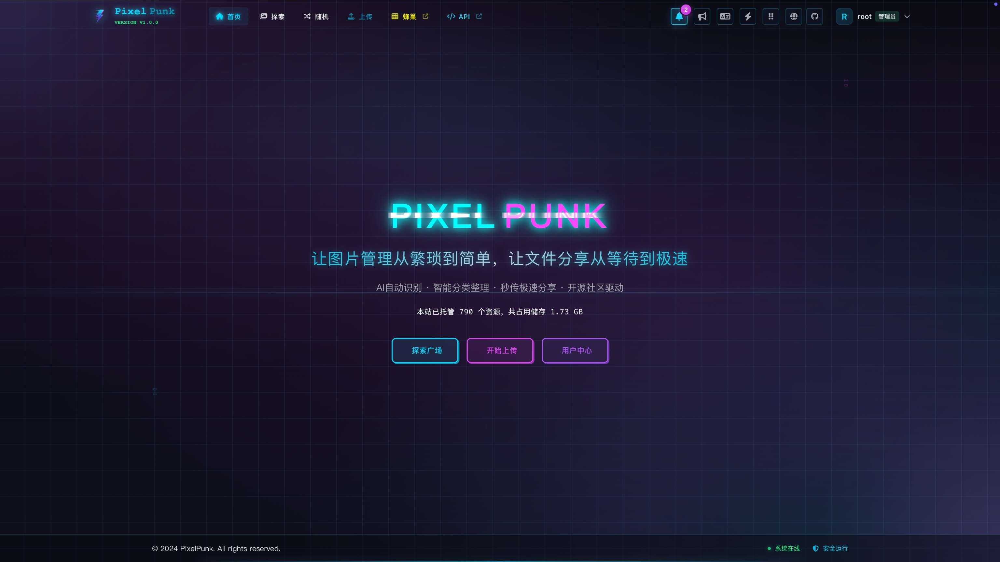
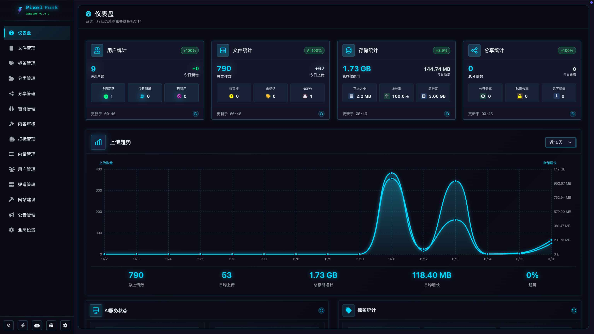

<div align="center">
  

# PixelPunk

**全栈式智能图床与资源管理平台**

> 让图片管理从繁琐到简单，让文件分享从等待到极速

[](https://go.dev/)
[](https://vuejs.org/)
[](https://www.docker.com/)
[](https://openai.com/)
[](https://qdrant.tech/)
[](https://redis.io/)

[English](./README.md) | [简体中文](./README_CN.md) | [官方网站](https://pixelpunk.cc/) | [在线体验](https://v1.pixelpunk.cc/)

</div>

<div align="center">
  
</div>

---

### 网站首页

<div align="center">
  
</div>

### 后台管理

<div align="center">
  
</div>

---

## ✨ 全面功能特性

<table>
<tr>
<td width="33%" valign="top">

### 📸 多格式上传

- ✅ 支持 10+ 格式上传
- ✅ 自定义水印
- ✅ 有效期限时保存
- ✅ 自定义上传文件夹
- ✅ 自定义文件权限

</td>
<td width="33%" valign="top">

### 📁 文件管理

- ✅ 无限层级嵌套文件夹
- ✅ 标签与分类系统
- ✅ 批量操作
- ✅ 拖拽操作
- ✅ 自定义右键菜单
- ✅ 收藏夹快速访问

</td>
<td width="33%" valign="top">

### 🔍 强大搜索

- ✅ 自然语言搜索
- ✅ 标签搜索
- ✅ 分类搜索
- ✅ 混合搜索
- ✅ 管理端渠道搜索

</td>
</tr>

<tr>
<td width="33%" valign="top">

### 🤖 AI 自动化处理

- ✅ 自动分类图片
- ✅ 自动打标图片
- ✅ 自动语义化解析图片
- ✅ 自动 NSFW 审核图片

</td>
<td width="33%" valign="top">

### 🧠 向量搜索

- ✅ 以图搜图
- ✅ 语义相似度搜索
- ✅ 智能推荐关联图片
- ✅ 基于 Qdrant 向量引擎

</td>
<td width="33%" valign="top">

### 🔗 灵活分享

- ✅ 文件夹/图片/混合分享
- ✅ 密码保护与有效期
- ✅ 相册与打包下载
- ✅ 访问邮件通知

</td>
</tr>

<tr>
<td width="33%" valign="top">

### 🔐 权限控制

- ✅ 防盗链
- ✅ IP 黑白名单
- ✅ 域名黑白名单
- ✅ 流量控制
- ✅ 带宽控制
- ✅ 访问统计分析

</td>
<td width="33%" valign="top">

### 🎨 多样主题

- ✅ 12+ 精选主题
- ✅ 赛博朋克、清新、可爱等风格
- ✅ 亮色/暗色自适应
- ✅ 动态主题切换

</td>
<td width="33%" valign="top">

### 🌍 国际化

- ✅ 🇨🇳 简体中文
- ✅ 🇺🇸 English
- ✅ 🇯🇵 日本語
- ✅ 双风格主题
- ✅ 更多语言支持中

</td>
</tr>

<tr>
<td width="33%" valign="top">

### 👥 权限管理

- ✅ 管理员/普通用户角色
- ✅ 精细化权限控制
- ✅ 用户组管理
- ✅ 操作日志审计

</td>
<td width="33%" valign="top">

### 💾 配额管理

- ✅ 流量控制
- ✅ 带宽控制
- ✅ 次数控制
- ✅ 动态调整

</td>
<td width="33%" valign="top">

### 🔧 开放 API

- ✅ 上传与随机图片接口
- ✅ 文件夹绑定与素材固定
- ✅ 权限验证与访问统计
- ✅ 次数/类型/尺寸限制

</td>
</tr>

<tr>
<td width="33%" valign="top">

### 🚀 易于部署

- ✅ 单文件二进制
- ✅ Docker 容器化
- ✅ 跨平台支持
- ✅ 一键安装包

</td>
<td width="33%" valign="top">

### 📊 数据统计

- ✅ 上传统计图表
- ✅ 存储空间分析
- ✅ 访问量统计
- ✅ 用户行为分析

</td>
<td width="33%" valign="top">

### 🎛️ 管理系统

- ✅ 可视化管理界面
- ✅ 实时系统监控
- ✅ 一键配置管理
- ✅ 操作便捷直观

</td>
</tr>
</table>

## 💻 系统要求

### 最低配置

- **操作系统**: Linux (x86_64/ARM64) / macOS (Intel/Apple Silicon) / Windows (WSL2)
- **CPU**: 2 核心
- **内存**: 2GB RAM
- **磁盘**: 10GB 可用空间
- **网络**: 互联网连接（AI 功能需要）

### 推荐配置（生产环境）

- **CPU**: 4 核心及以上
- **内存**: 4GB RAM 及以上
- **磁盘**: 50GB SSD 及以上
- **网络**: 稳定的互联网连接，带宽 100Mbps+

### 依赖服务（Docker 模式自动安装）

- **数据库**: MySQL 5.7+ / SQLite 3.x
- **缓存**: Redis 6.0+
- **向量数据库**: Qdrant 1.11+（可选，用于 AI 搜索功能）
- **AI 服务**: OpenAI API 或兼容接口（可选，用于 AI 功能）

---

## 🚀 快速开始

### 方式一：一键安装

```bash
curl -fsSL http://download.pixelpunk.cc/shell/setup.sh | bash
```

**支持平台**：Linux (x86_64/ARM64)、macOS (Intel/Apple Silicon)

安装脚本会自动：

- ✅ 检测系统平台
- ✅ 下载对应安装包
- ✅ 解压并配置环境
- ✅ 启动 PixelPunk 服务

安装完成后，访问 `http://localhost:9520` 开始使用。

### 方式二：Docker 部署

```bash
# 拉取镜像
docker pull snine98/pixelpunk:latest

# 下载 docker-compose.yml
curl -O https://download.pixelpunk.cc/docker/docker-compose.yml

# 启动所有服务（包含 MySQL + Qdrant + Redis）
docker-compose up -d
```

访问 `http://localhost:9520` 开始使用。

---

## 🎯 首次使用指南

### 1. 访问系统

部署完成后，打开浏览器访问：

- **一键安装**: http://localhost:9520
- **Docker 部署**: http://localhost:9520
- **自定义端口**: 检查您的配置文件

### 2. 初始化设置

首次访问会自动跳转到安装页面，需要完成以下配置：

#### 数据库配置

- **SQLite 模式**（推荐个人使用）: 自动创建本地数据库，无需额外配置
- **MySQL 模式**（推荐生产环境）: 填写数据库连接信息
  - 主机: localhost:3306（Docker 模式自动配置）
  - 数据库名: pixelpunk
  - 用户名: root
  - 密码: 您设置的密码

#### 管理员账号

设置初始管理员信息：

- 用户名: 推荐使用 admin 或您的常用用户名
- 密码: 至少 8 位，建议包含字母和数字
- 邮箱: 用于接收通知（可选）

### 3. 登录系统

初始化完成后，使用您设置的管理员账号登录：

1. 点击右上角「登录/注册」
2. 输入用户名和密码
3. 登录成功后自动跳转到控制面板

### 4. 开始使用

登录后，您可以：

- 📤 **上传图片**: 点击「开始上传」或直接拖拽文件
- 📁 **管理文件**: 在「文件管理」中查看、编辑、删除文件
- 🔗 **创建分享**: 右键文件或文件夹，选择「创建分享」
- 🎨 **切换主题**: 点击右上角主题图标，选择喜欢的风格
- 🌍 **切换语言**: 点击语言切换按钮（中文/English/日本語）

---

### 更多资源

- [📥 下载发行版](https://github.com/CooperJiang/PixelPunk-v1/releases) - 下载预编译安装包，手动安装
- [🏗️ 架构设计](docs/ARCHITECTURE.md) - 系统架构、流程设计、技术选型
- [🚀 部署文档](docs/DEPLOYMENT.md) - 完整部署指南（一键安装、Docker、手动部署）
- [🐳 Docker 指南](docs/DOCKER-GUIDE.md) - Docker 容器化部署详解
- [📘 开发文档](docs/DEVELOPMENT.md) - 搭建开发环境，从源码构建
- [🎨 主题开发](web/docs/THEME-DEVELOPMENT-GUIDE.md) - 创建自定义主题
- [🌍 国际化](web/docs/I18N-GUIDE.md) - 添加多语言支持
- [🤝 贡献指南](docs/CONTRIBUTING.md) - 如何参与项目贡献

---

## 🛠️ 技术栈

- **前端**: Vue 3 + TypeScript + Vite + Pinia + Vue Router + Tailwind CSS + CSS Variables + FontAwesome + Axios + VueUse
- **后端**: Go 1.24 + Gin + GORM + JWT + Viper + Zap
- **数据库**: SQLite / MySQL + Redis + Qdrant (向量数据库)
- **AI**: OpenAI API 兼容接口 + Embedding 模型 + 语义搜索
- **运维**: Docker + Docker Compose + Nginx/Caddy + Systemd + Make

---

## 📊 Star History

如果觉得项目不错，欢迎 Star ⭐ 支持！

[](https://star-history.com/#CooperJiang/PixelPunk&Date)

---

## 🤝 贡献

欢迎各种形式的贡献！

### 如何贡献

- 🐛 [报告 Bug](https://github.com/CooperJiang/PixelPunk-v1/issues/new?labels=bug)
- 💡 [提出新功能](https://github.com/CooperJiang/PixelPunk-v1/issues/new?labels=enhancement)
- 📖 [改进文档](https://github.com/CooperJiang/PixelPunk-v1/issues/new?labels=documentation)
- 💻 [提交代码](docs/CONTRIBUTING.md)

详见 [贡献指南](docs/CONTRIBUTING.md) 了解完整的贡献流程。

---

## 📝 许可证

本项目采用 **PolyForm Noncommercial License 1.0.0** 许可证。

- ✅ 个人使用
- ✅ 学习研究
- ✅ 非商业用途
- ❌ 商业使用需授权

详见 [LICENSE](./LICENSE) 文件。

## 🚧 待实现功能

- [ ] 后端多语言适配
- [ ] UI 美化
- [ ] Desktop 端开发
- [ ] 更多格式支持
- [ ] 交互优化
- [ ] 更多渠道支持
- [ ] 更多 AI 接入

---

<div align="center">
  <sub>Built with ❤️ by <a href="https://github.com/CooperJiang">CooperJiang</a></sub>
</div>
